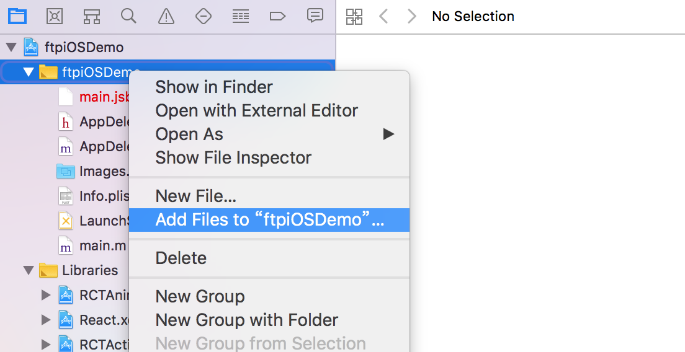
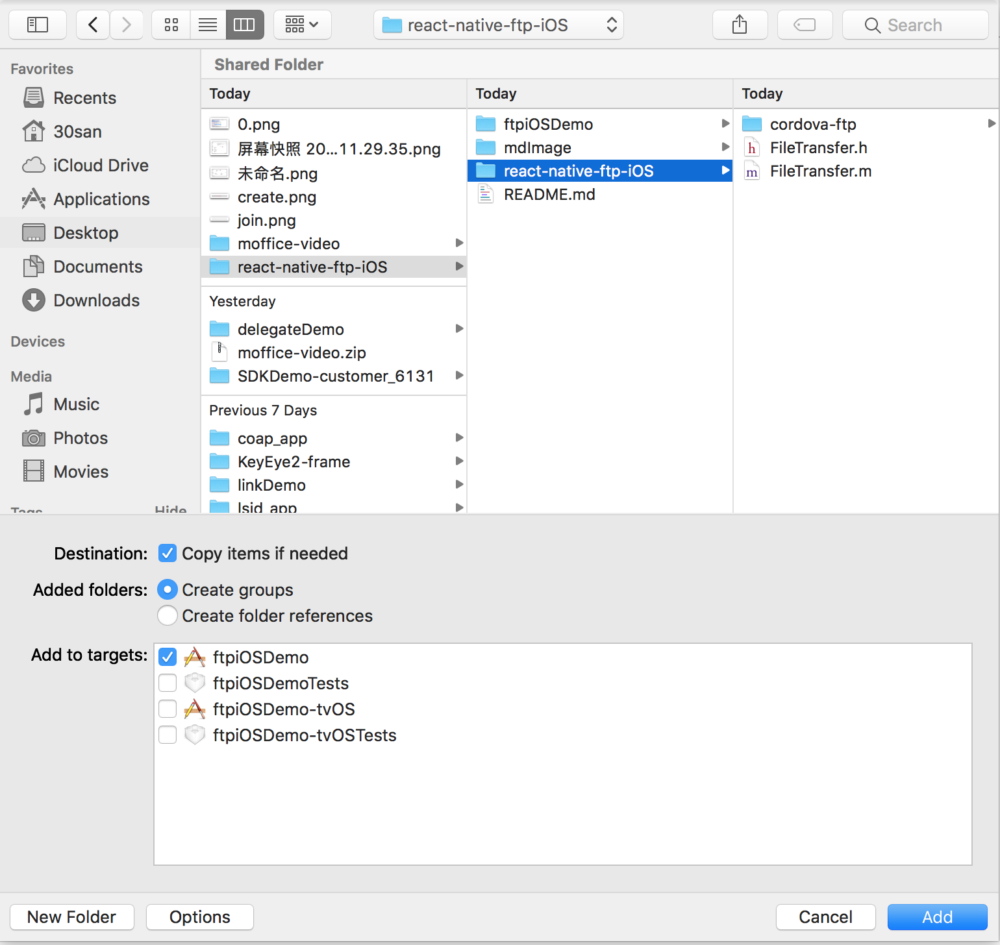
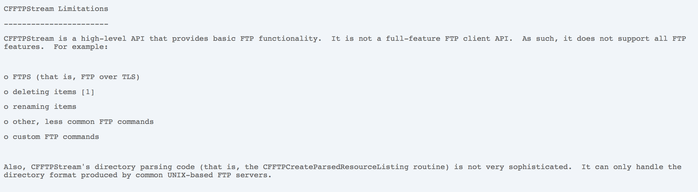

# react-native-ftp-iOS
### ReactNative NativeModule FTP (iOS only)

由cordova插件 cordova-plugin-ftp 改造，
根据公司需求加了多个传输队列，封装了RN自定义插件接口，

目前还没去研究怎么做成可以 npm install --save 那种方式，
~~使用说明文档以后再加（也有可能忘了加）~~
~~或者可以考虑写个RN的demo啥的，~~

~~如果有刚好需要用的同学请在issues留言催促我写使用说明加demo，~~

想不到竟然会有补全这个文档和Demo的机会，想不到啊想不到

那就以写这个demo的机会顺便记录一下写demo的全过程，当做集成参考：

### 集成参考

init 这里用 0.44.3做demo

```
react-native init ftpiOSDemo --version 0.44.3
```

完成后进入目录 npm install 加 react-native link 二连

然后点击 ftpiOSDemo/ios/ftpiOSDemo.xcodeproj 使用 Xcode 打开项目

然后添加把 react-native-ftp-iOS 插件作为自定义插件添加到项目工程文件





至此，自定义插件集成完成

### 使用参考及说明

ftpiOSDemo/index.ios.js

```
import React, { Component } from 'react';
import {
  AppRegistry,
  StyleSheet,
  Text,
  View,
  NativeModules,//使用自定义插件需要引入 NativeModules
  NativeEventEmitter,//使用自定义插件监听功能需要引入 NativeEventEmitter
} from 'react-native';

// 文件传输完成的监听
const Emitter = new NativeEventEmitter(NativeModules.FileTransfer);
export default class ftpiOSDemo extends Component {
  componentDidMount(){
      // 文件传输完成
      Emitter.addListener('completed', (completedFileInfoObj) => {
          const transferId = completedFileInfoObj.transferId;
          const isUpload = completedFileInfoObj.isUpload;
          const toAccount = completedFileInfoObj.toAccount;
          //通过传输任务ID及相关参数判断完成的任务
      });
      // 文件传输异常
      Emitter.addListener('fileTransfer', (errorInfoObj) => {
          //通过传输任务ID及相关参数判断完成的任务
      });
      // 文件传输的进度跟踪
      Emitter.addListener('updateProgress', (progressInfoObj) => {
          // 会不停地触发来更新进度 ，通过 transferId 来确认进度属于哪个任务
          const transferId = progressInfoObj.transferId;
          const percent = progressInfoObj.percent;
      });
  }

  download(){
    const ftpTask = {
        ftpServerIp: '10.131.129.40', //链接的FTP服务器IP
        username: 'admin', //登录FTP服务器的账户
        password: 'admin', //登录FTP服务器的密码
        ftpServerPort: 990, //FTP服务器端口
        fileMimeType: 'other', // other image audio 三种类型选一个
        isUpload: false, //上传 - true 下载 - false
        localPath: 'file:///xxx',//(本地文件的绝对路径) file:///开头
        remoteFilePath: '/', //(绝对路径) ，上传时提供文件夹地址，后带 "/" eg /2016-11-11-1/，下载时提供文件地址(2016-11-11-1/down)
        toAccount: '文件发送对象',// 与FTP传输无关，能在传输监听中拿到，方便后续逻辑处理
        transferId: '23333333xxx',// 与FTP传输无关，能在传输监听中拿到，方便后续逻辑处理
        fileSize: 233333, // 与FTP传输无关，能在传输监听中拿到，方便后续逻辑处理
        isSSL: false, // iOS不支持ssl ，无用参数，方便与安卓版统一接口
    };
    NativeModules.FileTransfer.addFtpTask(ftpTask)
  }

  render() {
    return (
      <View style={styles.container}>
        <Text style={styles.welcome} onPress={this.download.bind(this)}>
          下载示范
        </Text>
      </View>
    );
  }
}

const styles = StyleSheet.create({
  container: {
    flex: 1,
    justifyContent: 'center',
    alignItems: 'center',
    backgroundColor: '#F5FCFF',
  },
  welcome: {
    fontSize: 20,
    textAlign: 'center',
    margin: 10,
  },
});

AppRegistry.registerComponent('ftpiOSDemo', () => ftpiOSDemo);
```

具体使用注释已大约说明

插件还提供的方法有

```
NativeModules.FileTransfer.cancelFtpTask()
```

使用方式类似，这里就不多做说明了

### 额外的

写demo的时候本来想找一个公开的FTP文件服务器来写进Demo感觉更有说服力，然后并没有找到[有可使用的请联系我，我会补充demo]

[iOS-FTP 官方文档](https://developer.apple.com/library/content/samplecode/SimpleFTPSample/Introduction/Intro.html#//apple_ref/doc/uid/DTS40009243-Intro-DontLinkElementID_2) 

插件根据公司实际需要增加了一些比较特殊的接口参数，个人建议参考 [GoldRaccoon](https://github.com/albertodebortoli/GoldRaccoon) 自行进行RN插件封装

可用此 [GoldRaccoon](https://github.com/albertodebortoli/GoldRaccoon) 进行FTP服务器基本测试，此插件核心代码来自GoldRaccoon

关于FTPS不支持的说明：



[来自iOS-FTP官方文档说明](https://developer.apple.com/library/content/samplecode/SimpleFTPSample/Listings/Read_Me_About_SimpleFTPSample_txt.html#//apple_ref/doc/uid/DTS40009243-Read_Me_About_SimpleFTPSample_txt-DontLinkElementID_16)  硬要使用FTPS的话可考虑使用 Curl 实现[南而我并没有去后续实现]

关于android版，可参考 [react-native-ftp](https://github.com/ne0z/react-native-ftp) 

或者，我在项目工程中放了一个 android/FileTransferModule.java

是与该iOS版配套使用的 android 自定义插件，在RN中的调用代码一致，

因为本人不会安卓，所以无法详细告知如何集成及使用，请谅解

也没去研究怎么做成可以 npm install --save 那种方式，所以目前只能以自定义插件形式来实现功能


つづく
